# GADS2020 Cloud Project Phase II

## Qwiklabs Completed

  
App Dev: Setting up a Development Environment v1.1

  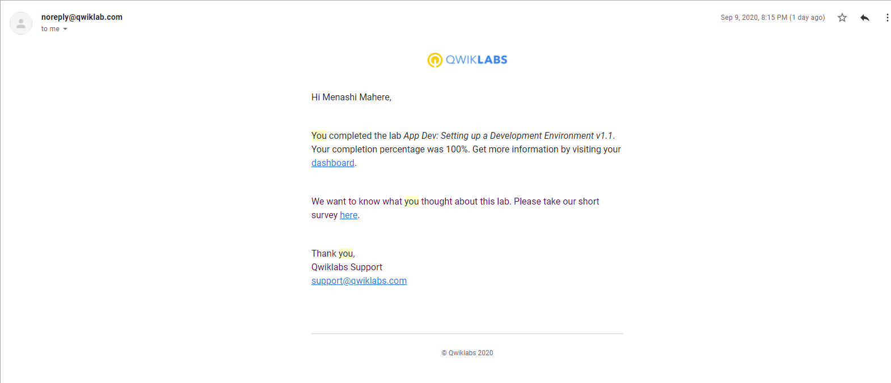

  
Automating the Deployment of Infrastructure Using Terraform

  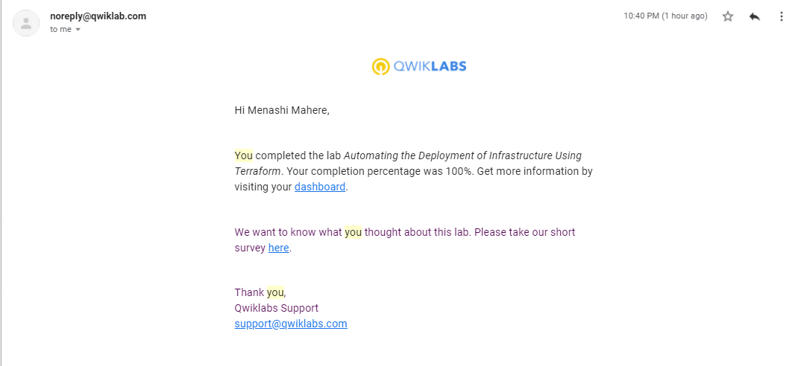

  
Configuring an Internal Load Balancer 

  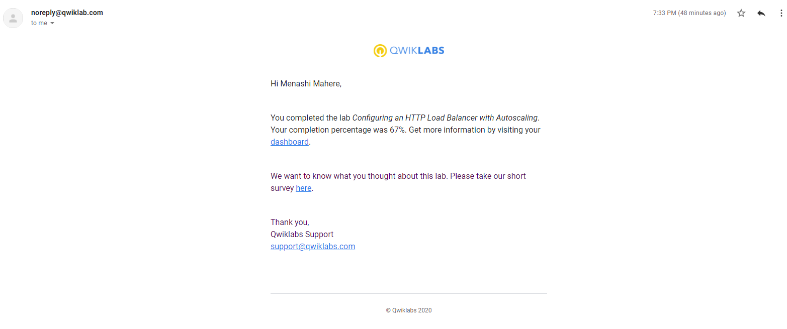

  
Configuring an Internal Load Balancer

  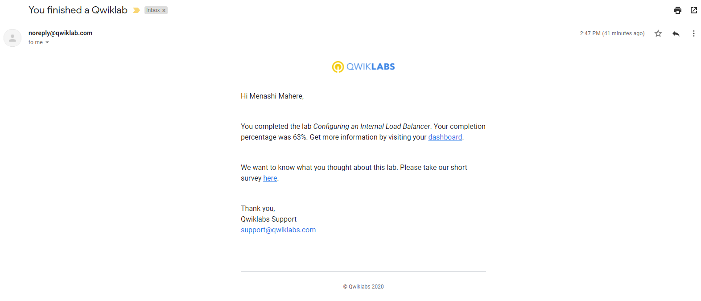

  
GCP Fundamentals: Getting Started with BigQuery

  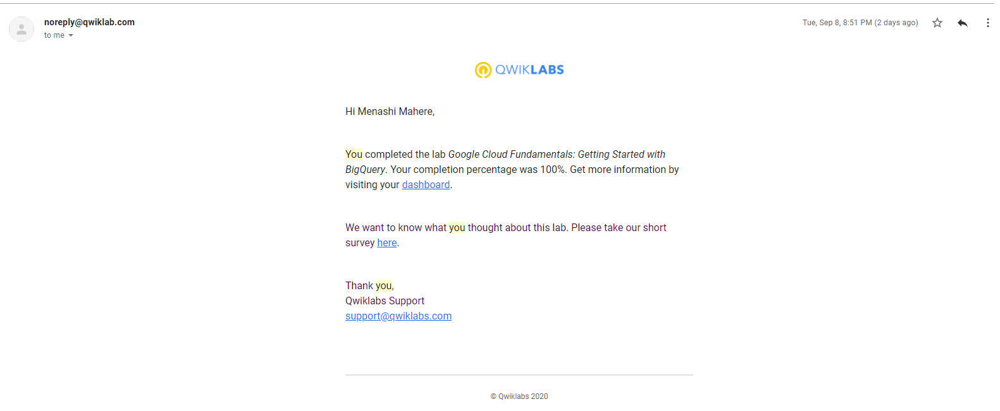

  
GCP Fundamentals: Getting Started with Cloud Marketplace

  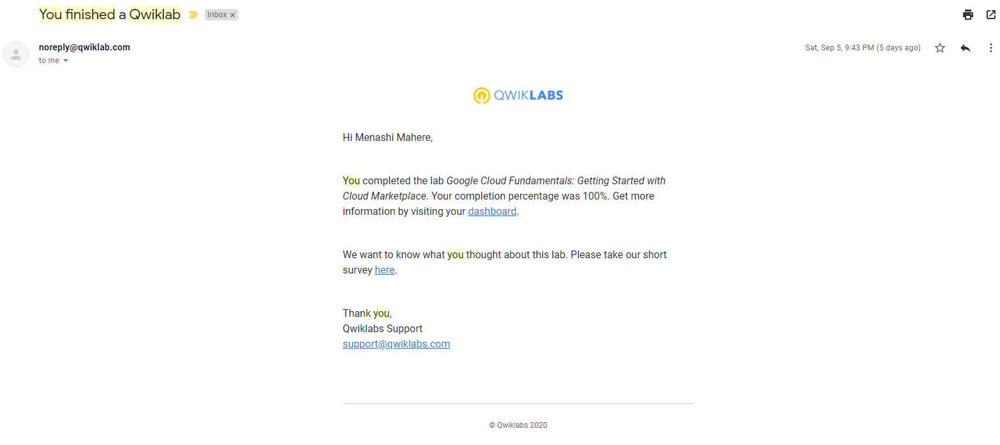

  
GCP Getting Started with Cloud Storage and Cloud SQL

  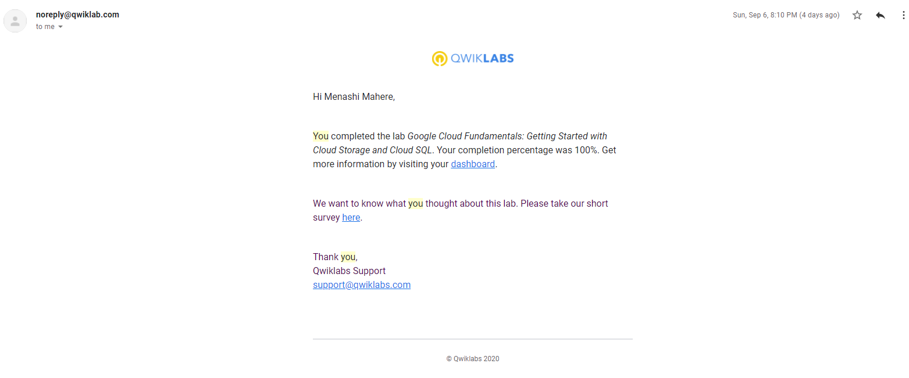

  
GCP Fundamentals: Getting Started with Compute Engine

  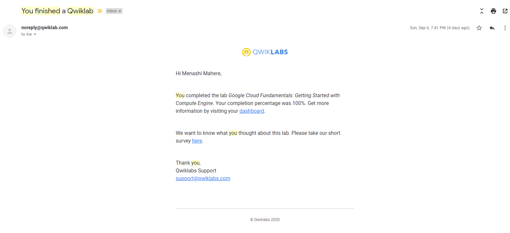

  
GCP Fundamentals: Getting Started with Deployment Manager and Stackdriver

  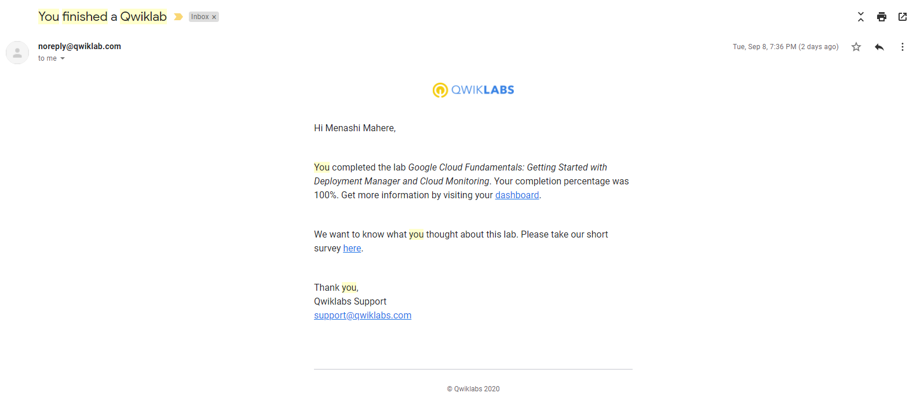

  
GCP Fundamentals: Getting Started with Kubernetes Engine

  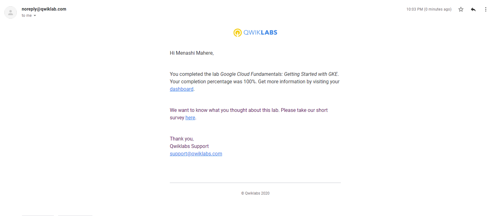

  
GCP Fundamentals: Getting Started with App Engine

  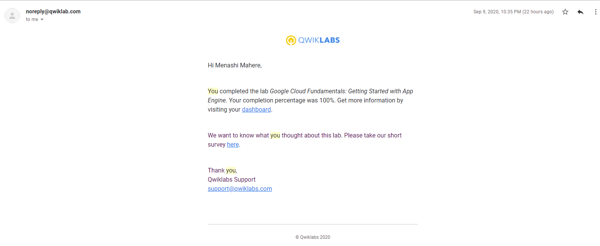

  
Implement Private Google Access and Cloud NAT

  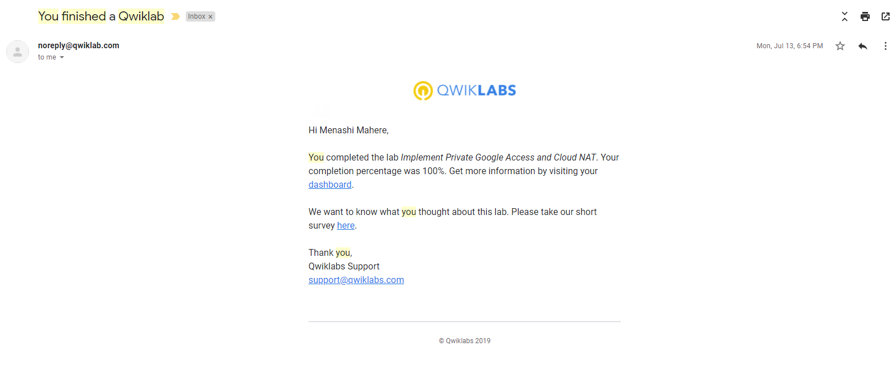

  
Recommend Products using ML with Cloud SQL and Dataproc

  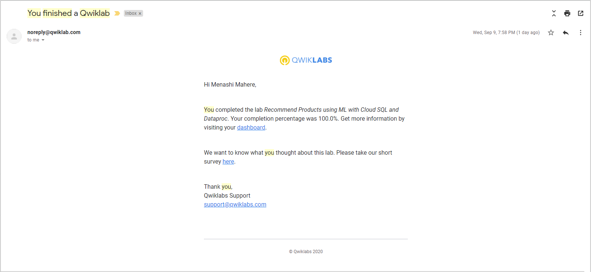

  
VPC Networking

  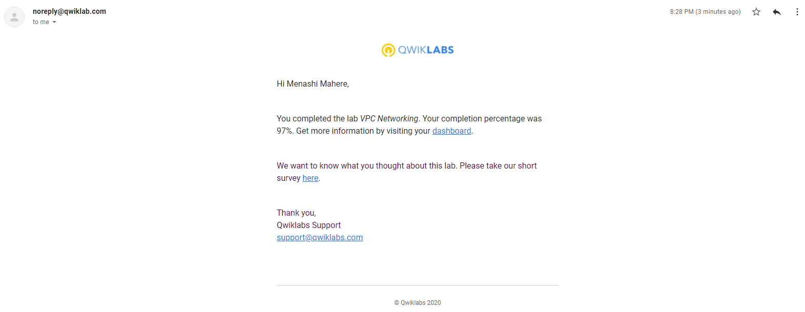

## Translation Code

[Google Cloud Fundamentals: Getting Started with Compute Engine](lab-1-creating-vms.md)

[Google Cloud Fundamentals: Getting Started with Kubernetes Engine](lab-2-getting-started-with-gke.md)
